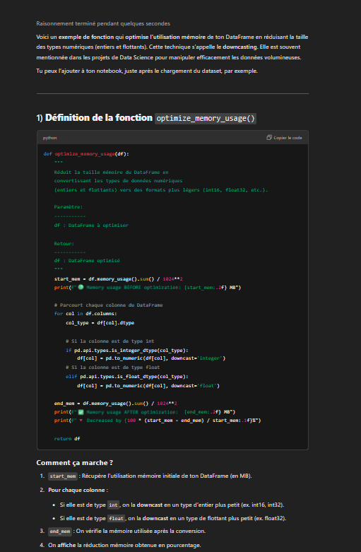
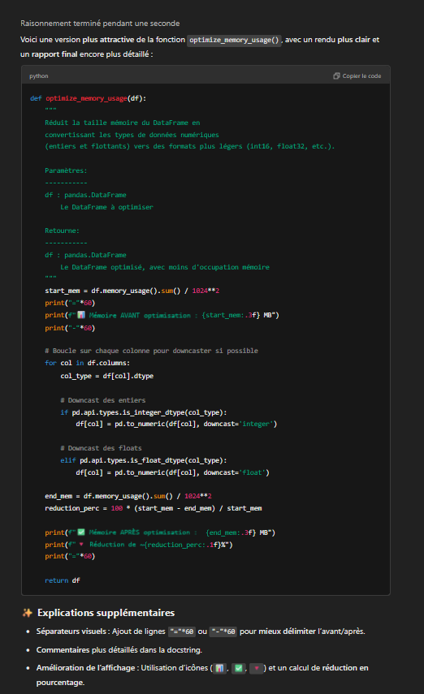
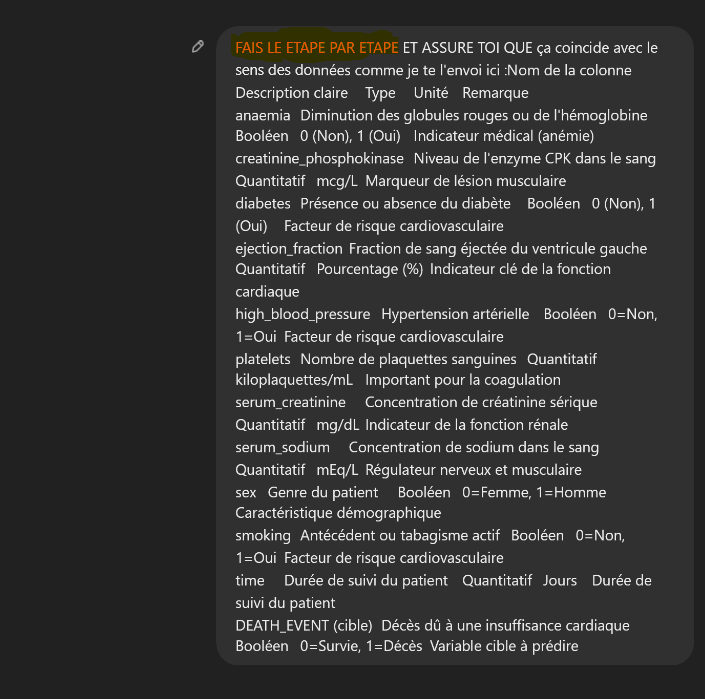
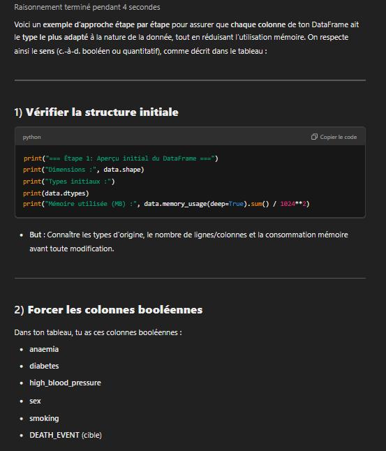
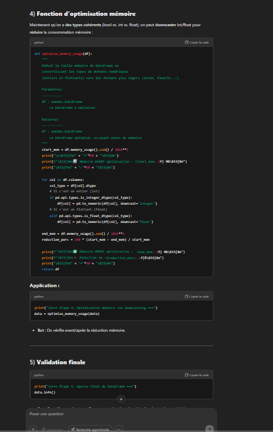

# Prompt Engineering Documentation

## 1. Introduction
This document provides a structured prompt engineering documentation efforts in the project.

## 2. Model Used
- **AI Model:** ChatGPT

## 3. Chosen Task
- **Task Name:** Optimizing Memory Usage Function Implementation

##Prompt Engineering 

The screenshots used in this documentation can be found in the [reports/Prompt](reports/Prompt) folder.

---

## 1. Context and Objectives

- **First Prompt:**  
  This prompt sets the context. The Notebook file is sent, which defines:
  - The overall context
  - The Coding Week
  - The objective: the *optimizing memory usage* function  
  The Notebook also specifies where to find the necessary information (within the designated folder).

  

- **Response 1:**  
  The first response provided is, in principle, complete. It includes detailed examples explaining how the function works.

  

> **Comment:** The first prompt and answer set the stage by clearly defining the problem space and goals. This helps ensure subsequent prompts can be more specific and build upon the initial context.

---

## 2. Creative Exploration and Improvement
**Objective:**  
- Encourage a broad, creative response from the AI.  
- Gather initial impressions and potential directions for further refinement.

- **Second Prompt:**  
  The second prompt is deliberately vague, giving the AI a lot of freedom.  
  > This approach allows for a creative first impression and serves as inspiration for later improvements.  
  Although this prompt is less precise, it offers an interesting starting point for further refinement.

  

  
- **Response 2:**
   
  > **Critique:** While Prompt 2 can spark creativity, it isn’t considered best practice to give an AI an entirely vague instruction without clear goals. This can lead to responses that deviate significantly from project objectives. However, in situations where you lack specific ideas or want the AI to propose novel approaches, an open-ended prompt can still be a useful technique.
---
  
## 3. **Prompt 3**
**Objective:**  
- Reuse a portion of the AI-generated code from the previous responses.  
- Directly request improvements in code formatting and structure

- **Third Prompt:**  
  In this prompt, a part of the AI's code is copied and reused.  
  The instruction is to use formatting in the code (for instance, to optimize display and space usage).  
  The response obtained is correct, though some elements could be improved.

  

  > **Comment:** Prompt 3 and its answers illustrate the **iterative** nature of prompt engineering. By pinpointing specific aspects (e.g., formatting), we guide the AI to address those needs directly.

---

## 4. Iterative Approach and Finalization

- **Fourth Prompt:**  
  Here, a detailed context is defined and the instruction is given to execute tasks step by step.  
  This approach results in a very complete and well-structured response, with an effective use of step-by-step tasks.
  **Objective:**  
- Provide a detailed context for the AI to tackle tasks step by step.  
- Showcase how breaking down a problem into smaller sub-tasks can yield more thorough and organized answers.

  

  - **Response 4:**
   

  - **Response 4:**
   

> **Comment:** Step-by-step instructions are a powerful prompt engineering strategy, guiding the AI to address each portion of the problem thoroughly before moving on to the next.

---

- **Final Compilation:**
  **Objective:**  
  - Compile all the code snippets and improvements from previous prompts into a single, cohesive final product.  
  - Ensure that the final output reflects every enhancement requested throughout the prompt engineering process.
  
  The final prompt asks to compile all the code snippets and provide the complete final code.  
  This final code incorporates all the improvements and optimizations made during the different iterations.

  

  > **Comment:** By the final prompt, the AI has gathered sufficient context and feedback to produce a polished, comprehensive solution that integrates all prior revisions and recommendations.

---

## **Key Takeaways**

1. **Contextual Clarity:** Starting with a well-defined context ensures that subsequent prompts and answers remain focused on the project’s goals.  
2. **Creative Exploration:** Introducing open-ended prompts can spark innovation, yielding ideas that may be refined later.  
3. **Iterative Refinement:** Repeatedly revisiting and refining prompts allows for continuous improvement in both code quality and explanation clarity.  
4. **Structured Breakdown:** Providing step-by-step instructions ensures thoroughness and clarity in complex tasks.  
5. **Final Compilation:** Consolidating all refined code snippets into one final product ensures consistency and completeness.

By following these principles, the prompt engineering process becomes a powerful tool for extracting high-quality, context-aware solutions from AI models.
