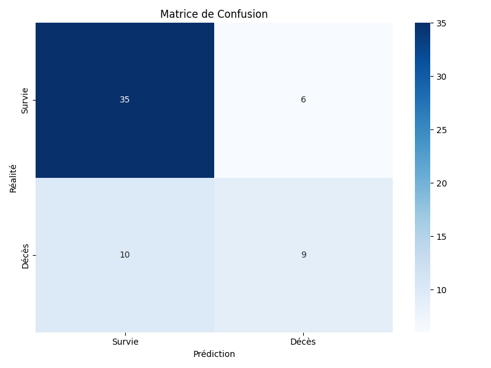
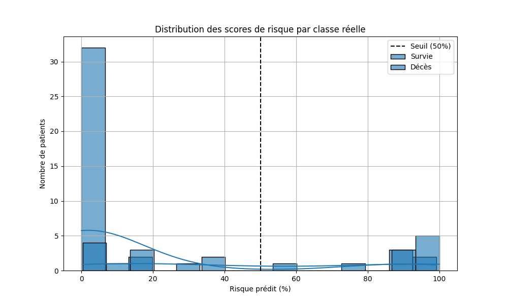

# Heart Failure Risk Prediction

### ML-Powered Clinical Decision Support System

*Predicting heart failure mortality risk using ANN with SHAP explainability, deployed as a Flask web app for clinical use.*

 

---

## Context
Heart failure is a severe chronic condition that impairs the heart’s ability to pump blood effectively. It can lead to life-threatening complications if not detected early.
With the advancement of medical data analysis and artificial intelligence, we can now develop predictive models to assess heart failure risk and assist doctors in making more informed decisions.

---

## 🎯 Project Objectives

### 📌 Our goal?  
Develop a Machine Learning model capable of predicting the **risk of death** due to heart failure based on clinical data.

### 📌 Why?  
- 🔹 Improve **patient care** and early risk detection.  
- 🔹 Identify the **most influential medical factors**.  
- 🔹 Provide a **clear explanation** of model predictions using **SHAP**.  
- 🔹 Design an **intuitive interface** for seamless clinical use.

---
## App Demo and Test Demo with Pytest

Demo of the flask web app :  
[watch the video](./reports/app_demo.mp4)

Demo of the test with pytest:
[watch the video](./reports/test_demo_with_pytest.mp4)

---

## 📊 Dataset Source

### 📂 Dataset Name:  
**Heart Failure Clinical Records**

### 📍 Source:  
**UCI Machine Learning Repository**

### 🔗 Link:  
[UCI Heart Failure Dataset](https://archive.ics.uci.edu/ml/datasets/Heart+failure+clinical+records)

> 💡 This dataset contains **clinical data** on patients with heart failure, including biological measurements, medical history, and follow-up information. It serves as the foundation for training and testing our predictive models.
---

## 🤖 Machine Learning Methodology

### 📌 1. Data Collection & Preprocessing
The first step into machine learning requires a meticulous study of the Data provided . In this work ,the cardiac risk dataset was meticulously cleaned and prepared using StandardScaler to normalize features, ensuring zero mean and unit variance. A stratified train-test split of 80/20 maintained the original class distribution, providing a robust foundation for the neural network's cardiac risk prediction model.

### 📌 2. Handling Class Imbalance
- Analyze the dataset distribution (68% survived, 32% deceased).  
- Apply class balancing techniques such as SMOTE, undersampling, or class-weighting.

### 📌 3. Model Selection & Training
Experimenting with different machine learning models : LightGBM Classifier , Random Forest Classifier ,Logistic Regression and Artificial Neural Network . By testing these models and their outputs we were able to identify the model that answers best to a doctor's needs for a specific accurate and non binary response. Unlike regression and  classifying models , the Artificial neural network (ANN) , with its sigmoide activation function, was able to be more flexbile assuring a close to accurate response for any patient . The other models were highly precise , however do not predict in an non linear way the heart failure risk .

### 📌 4. Model Evaluation
- We assesed performance using the following metrics:  
  - **ROC-AUC Score**  
  - **Accuracy**  
  - **Precision, Recall & F1-score**  
- We compare model results and select the best-performing one.
The Artificial Neural Network (ANN) demonstrated promising results in predicting heart failure risk. Key performance metrics included:
Accuracy: 75-80%
Precision: Improved through iterative refinement
Recall: Critically optimized to minimize false negatives
AUC-ROC: Validated model's discriminative capabilities
We emphasise that the selection of the model was based on the one that fitted most the need of predciting heart failure risk . Thus , there is a need for a non linear model that can understand the hidden connexion between the inputs ( clinical data ) and the target ( death event) ( using the sigmoide function the ouputs becomes between 0 and 1 giving a non linear approach) .

### 📌 5. Model Explainability with SHAP
To enhance model transparency, we implemented SHAP (SHapley Additive exPlanations) analysis. This technique provides detailed feature importance visualization ,insight into how each clinical factor influences risk prediction
and interpretable results for medical professionals.

### 📌 6. Deployment & User Interface
- Develop an interactive Flask web application for real-time predictions.  
- Allow physicians to input patient data and visualize results.

To make the model easy to use by doctors , we implemented it in an intuitive web interface allowing easy input of patient clinical data , displaying risk prediction with clear categorization and providing immediate , actionable insights . An other feature was added to the plateform was the sport space . In this link the doctor can enter clinical data needed of an athlete . Why ? In fact , the heart failure risk might be different from one person to another ; but for athletes many unidentied factors can influence in the heart failure risk . In fact , the most common cause of death for athletes is a heart failure . This is why more inputs are a must when it comes to athletes.

# Prompt Engineering Documentation

## 1. Introduction
This document provides a structured prompt engineering documentation efforts in the project. The chosen task: test and automation through CI/CD.

## 2. Model Used
- **AI Model:** ChatGPT

## 3. Chosen Task
- **Task Name:** Optimizing Memory Usage Function Implementation

##Prompt Engineering 

The screenshots used in this documentation can be found in the [reports/Prompt](reports/Prompt) folder.

---

## 1. Context and Objectives

- **First Prompt:**  
  This prompt sets the context. The Notebook file is sent, which defines:
  - The overall context
  - The Coding Week
  - The objective: the *optimizing memory usage* function  
  The Notebook also specifies where to find the necessary information (within the designated folder).

  

- **Response 1:**  
  The first response provided is, in principle, complete. It includes detailed examples explaining how the function works.

  

> **Comment:** The first prompt and answer set the stage by clearly defining the problem space and goals. This helps ensure subsequent prompts can be more specific and build upon the initial context.

---

## 2. Creative Exploration and Improvement
**Objective:**  
- Encourage a broad, creative response from the AI.  
- Gather initial impressions and potential directions for further refinement.

- **Second Prompt:**  
  The second prompt is deliberately vague, giving the AI a lot of freedom.  
  > This approach allows for a creative first impression and serves as inspiration for later improvements.  
  Although this prompt is less precise, it offers an interesting starting point for further refinement.

  

  
- **Response 2:**
   
  > **Critique:** While Prompt 2 can spark creativity, it isn’t considered best practice to give an AI an entirely vague instruction without clear goals. This can lead to responses that deviate significantly from project objectives. However, in situations where you lack specific ideas or want the AI to propose novel approaches, an open-ended prompt can still be a useful technique.
---
  
## 3. **Prompt 3**
**Objective:**  
- Reuse a portion of the AI-generated code from the previous responses.  
- Directly request improvements in code formatting and structure

- **Third Prompt:**  
  In this prompt, a part of the AI's code is copied and reused.  
  The instruction is to use formatting in the code (for instance, to optimize display and space usage).  
  The response obtained is correct, though some elements could be improved.

  

  > **Comment:** Prompt 3 and its answers illustrate the **iterative** nature of prompt engineering. By pinpointing specific aspects (e.g., formatting), we guide the AI to address those needs directly.

---

## 4. Iterative Approach and Finalization

- **Fourth Prompt:**  
  Here, a detailed context is defined and the instruction is given to execute tasks step by step.  
  This approach results in a very complete and well-structured response, with an effective use of step-by-step tasks.
  **Objective:**  
- Provide a detailed context for the AI to tackle tasks step by step.  
- Showcase how breaking down a problem into smaller sub-tasks can yield more thorough and organized answers.

  

  - **Response 4:**
   

  - **Response 4:**
   

> **Comment:** Step-by-step instructions are a powerful prompt engineering strategy, guiding the AI to address each portion of the problem thoroughly before moving on to the next.

---

- **Final Compilation:**
  **Objective:**  
  - Compile all the code snippets and improvements from previous prompts into a single, cohesive final product.  
  - Ensure that the final output reflects every enhancement requested throughout the prompt engineering process.
  
  The final prompt asks to compile all the code snippets and provide the complete final code.  
  This final code incorporates all the improvements and optimizations made during the different iterations.

  

  > **Comment:** By the final prompt, the AI has gathered sufficient context and feedback to produce a polished, comprehensive solution that integrates all prior revisions and recommendations.

---

## **Key Takeaways**

1. **Contextual Clarity:** Starting with a well-defined context ensures that subsequent prompts and answers remain focused on the project’s goals.  
2. **Creative Exploration:** Introducing open-ended prompts can spark innovation, yielding ideas that may be refined later.  
3. **Iterative Refinement:** Repeatedly revisiting and refining prompts allows for continuous improvement in both code quality and explanation clarity.  
4. **Structured Breakdown:** Providing step-by-step instructions ensures thoroughness and clarity in complex tasks.  
5. **Final Compilation:** Consolidating all refined code snippets into one final product ensures consistency and completeness.

By following these principles, the prompt engineering process becomes a powerful tool for extracting high-quality, context-aware solutions from AI models.

### Prompt engineering documentation for the RNA model
Taking part in this work was generative AI specifically ChatGPT . This tool has been extremely helpful to enhance Python codes used for the machine learning models . For illustration , here is the prompt used for ChatGPT to evaluate the ANN model for prediction of heart failure risk : I'm developing a Neural Network for cardiac risk prediction. What evaluation metrics would be most relevant for a medical binary classification model?
This first prompt generated the metrics of the ANN and revelead that much work must be done to improve the model's precision . Thus comes the second prompt : For my cardiac risk neural network, how can I implement:
1. A robust performance evaluation method
2. Metrics tailored to a medical context where false negatives are critical
3. A validation strategy that minimizes the risk of overfitting
Finally, a last prompt for omptimization was needed : My neural network has an accuracy of 72%. How can I improve its performance, especially in reducing false negatives in a medical context?
The AI tool showed extreme adaptability to the different tasks asked . With its help the model was improved achieving a precision of 75%-80%.